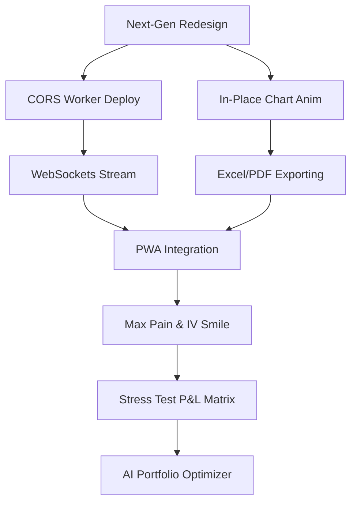

# Future Enhancements Roadmap: VJ Analysing the Market

This roadmap outlines high-priority, medium-priority, and long-term technical enhancements for the VJ Analysing the Market Derivative & Wealth Console. It includes implementation guidance, system architecture patterns, and code snippets to guide future updates.

### 1.2 Real-time WebSocket Data
Integrate a persistent WebSocket connection (e.g., via Finnhub, TradingView, or a custom socket gateway) to support live streaming tickers for NIFTY, SENSEX, and Sectoral indices.

#### Implementation Pattern:
```javascript
let socketConnection = null;

function connectMarketStream() {
    socketConnection = new WebSocket('wss://ws.finnhub.io?token=YOUR_API_KEY');

    socketConnection.onopen = function(e) {
        // Subscribe to indices
        socketConnection.send(JSON.stringify({'type':'subscribe', 'symbol': 'BINANCE:BTCUSDT'}));
    };

    socketConnection.onmessage = function(event) {
        const data = JSON.parse(event.data);
        if (data.type === 'trade') {
            updateLiveTickerValue(data.data[0].p); // Update DOM in-place
        }
    };

    socketConnection.onclose = function(event) {
        setTimeout(connectMarketStream, 5000); // Auto-reconnect
    };
}
```

---

## 2. Advanced Feature Modules

### 2.1 PDF Statement & Excel Exports
Provide downloadable summaries for calculators (such as Debt Amortization tables, SWP depletion schedules, and Tax comparison reports).

#### Implementation Architecture:
- Use **jsPDF** (via CDN) to compile clean PDF summaries.
- Use native data URIs to generate CSV downloads for spreadsheet imports:

```javascript
function exportTableToCSV(dataRows, filename) {
    let csvContent = "data:text/csv;charset=utf-8,";
    csvContent += dataRows.map(e => e.join(",")).join("\n");
    
    const encodedUri = encodeURI(csvContent);
    const link = document.createElement("a");
    link.setAttribute("href", encodedUri);
    link.setAttribute("download", filename);
    document.body.appendChild(link);
    link.click();
    document.body.removeChild(link);
}
```

---

### 2.2 Compare Mode
Enable side-by-side comparison of different scenarios (e.g., comparing a Regular SIP vs. a Step-Up SIP, or FD vs. RD vs. PPF yields over the same horizon).


## 3. Advanced Derivative Engineering Modules

### 3.1 Options Max Pain Calculator
Max Pain is the strike price where option sellers face the least aggregate loss at expiration. Implementing this helps options traders identify key market magnets.

#### Mathematical Formulation & Code Snippet:
For each test strike $K_{test}$, calculate the cumulative value of calls and puts assuming spot price expires exactly at $K_{test}$:
$$\text{Call Loss} = \sum \text{Call OI} \times \max(K_{test} - K, 0)$$
$$\text{Put Loss} = \sum \text{Put OI} \times \max(K - K_{test}, 0)$$
$$\text{Total Pain}(K_{test}) = \text{Call Loss} + \text{Put Loss}$$

```javascript
function findMaxPain(strikes, callsOI, putsOI) {
    let minPain = Infinity;
    let maxPainStrike = strikes[0];

    strikes.forEach(testStrike => {
        let totalPain = 0;
        strikes.forEach((strike, idx) => {
            const callOI = callsOI[idx] || 0;
            const putOI = putsOI[idx] || 0;
            
            // Call loss for sellers
            if (testStrike > strike) {
                totalPain += callOI * (testStrike - strike);
            }
            // Put loss for sellers
            if (testStrike < strike) {
                totalPain += putOI * (strike - testStrike);
            }
        });

        if (totalPain < minPain) {
            minPain = totalPain;
            maxPainStrike = testStrike;
        }
    });

    return maxPainStrike;
}
```

### 3.2 Implied Volatility (IV) Smile Curve
Visualizing the IV skew (smile) helps traders see whether calls or puts are relatively overpriced.
- Compute the IV for each option chain strike using a numerical search solver (e.g. Newton-Raphson approximation) on the Black-Scholes formula.
- Chart the strikes on the X-axis and computed IV on the Y-axis using a Chart.js spline line configuration.

### 3.3 Implied Volatility Rank (IV Rank) & Percentile
IV Rank gauges whether current option premiums are relatively cheap or expensive by looking at the high/low IV range over the past year:
$$\text{IV Rank} = \frac{\text{Current IV} - \text{Min IV}_{1Y}}{\text{Max IV}_{1Y} - \text{Min IV}_{1Y}} \times 100$$
IV Percentile calculates the percentage of days in the past 252 trading days that volatility was below the current level.

### 3.4 Multi-Scenario Stress Test Matrix (P&L Heatmap)
A cross-dimensional matrix that stress-tests the multi-leg strategy's P&L under simultaneous changes in the underlying Spot Price (X-axis, e.g. -6% to +6%) and changes in Implied Volatility (Y-axis, e.g. -30% to +30%).
- Color-coded cells (deep green for profit, deep red for loss) for immediate visual risk comprehension.

---

## 4. Product Roadmap Visual


